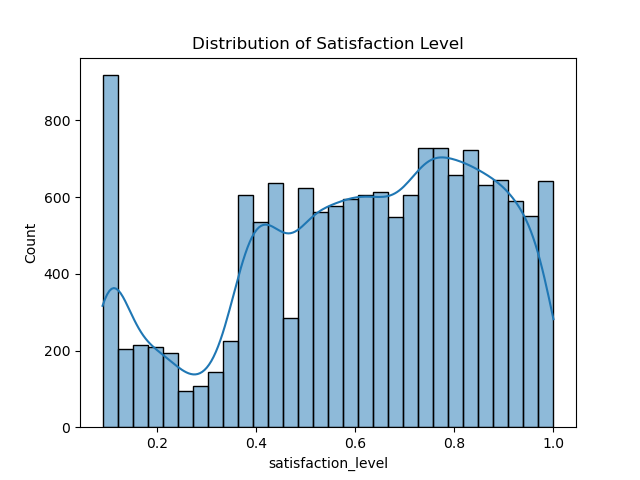

# Employee Attrition Analysis Report

## Overview
This report summarizes the findings of the employee attrition analysis for Sailfort Motors.

## Data Cleaning & Preparation
- Missing values: Checked
- Duplicates: Checked
- Outliers: Checked
- Column names standardized 

## Exploratory Data Analysis
### Satisfaction Level Distribution

### Average Monthly Hours Distribution

### Correlation Matrix

### Employee Left by Salary Level

### Employee Left by Department

## Model Performance
### Confusion Matrix

### ROC Curve

## Conclusion & Recommendations
- The model shows excellent performance with an AUC of 0.99.
- Precision: 0.99, Recall: 0.96, Accuracy: 0.99, F1 Score: 0.97.
- HR team can use this model to proactively identify employees at risk of leaving.
- Recommend quarterly retraining of the model.
- Suggested next steps: feature importance analysis, integration with HR systems.

---
_Report auto-generated by pipeline.py_
